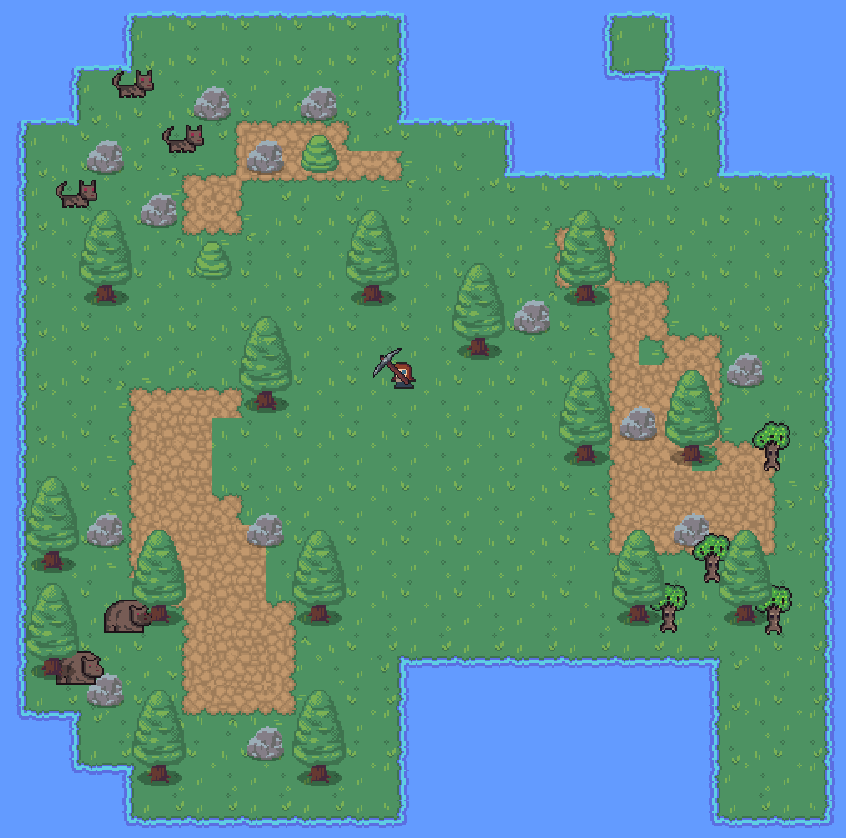

# 🌴 Genesis Island: Phaser Survival Game



---

[](https://www.typescriptlang.org/)
[](https://phaser.io/)
[](https://vercel.com/)

A **basic survival game** built with **Phaser 3** and **TypeScript** to practice game development fundamentals.

🔗 **[Test Demo](https://genesis-island-judadev.vercel.app/)**

---

## 🎮 About the Project
Genesis Island is a simple survival game where the player must navigate, collect resources, and avoid enemies. The goal is to learn and experiment with:
- **Phaser 3** physics and scenes
- **TypeScript** for type safety and clean code
- **Vercel** for easy deployment

---

## 🛠️ Built With
- **Phaser 3** – Game framework
- **TypeScript** – Strongly typed JavaScript
- **Vercel** – Hosting and deployment

---

## 🚀 Getting Started
1. Clone the repository:
   ```bash
   git clone https://github.com/tu-usuario/genesis-island.git
    ```

2. Install dependencies
```bash
npm install
```

3. Run the development server:
```bash
npm run dev
```

## 🎯 Features

- Player movement and collision
- Resource collection system
- Enemy AI with basic pathfinding
- Dynamic item drops

## 📄 License

This project is licensed under the MIT License

## 🙏 Acknowledgments

- Thanks to the Phaser community for excellent documentation
